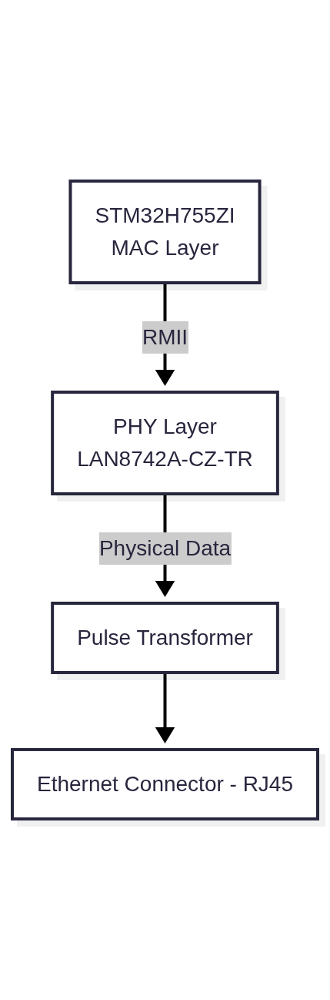
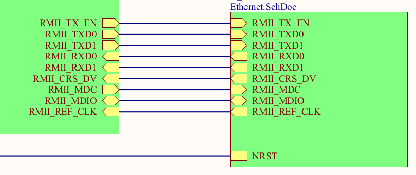

## NUCLEO144 H755ZIQ Ethernet
[Block Diagram](ethernet.mmd)

- The STM32h755Zi comes with an inbuilt MAC layer
- The nucleo board provides the PHY Layer for Ethernet.

- MAC Layer (Media Access Control)
    - MAC manages the connections like addresses, data packets and it also holds a unique MAC Address which can be used as an identifier in communications.
    - MAC is a not a physical layer. It is built in to the STM32H755ZI.
- PHY Layer (PHYsical Layer)
    - This manages the actual connection in a communication.
    - It have control over the clock speed.

For explaining let's consider the connection between MAC and PHY.
There are two standards, MII (Media Independent Interface) and reduced MMI (RMII).

In STM32s we use RMII because of the complexity of MMI connections.
| Feature        | MII      | RMII          |
| -------------- | -------- | ------------- |
| Data width     | 4-bit    | 2-bit         |
| TX clock       | Separate 25 MHz | Shared 50 MHz |
| RX clock       | Separate 25 MHz | Shared 50 MHz |
| Pin count      | ~16      | ~7            |
| PCB complexity | High     | Low           |

We just doubled the clock for simple connections. We can now dive deep into the RMII
## Reduced Media Independent Interface
- This connects the MAC to the PHY.
- Mac will send packets as 2 bit Nibbles
The Pins are:

| Pin | Usage| 
|:--|:--|
|REF_CLK | The continuos 50Mhz Clock |
| TXD0 | Transmit bit 0 (MAC -> PHY) |
| TXD1 | Transmit bit 1 (MAC -> PHY) |
| TX_EN | Transmit Enable (MAC -> PHY) AH|
| RXD0 | Transmit bit 0 (MAC -> PHY) |
| RXD1 | Transmit bit 1 (MAC -> PHY) | 
| CRS_DV | Carrier Sense and RX Data valied Multiplexed into single pin |

These are the required pins. also as opition:
| Pin | Usage| 
|:--|:--|
| RX_ER | Recieved Data Error |
| MDIO |  To manage PHY or bidirectional |
| MDC | Data management clock |

## Working of MAC in STM32H755ZI
- Ethernet DMA (ETH_DMxRx/Tx): The MAC does not move data to/from memory directly. Instead, it uses Descriptor Chains in memory. The DMA reads these descriptors (specifically ETH_DMASR, ETH_DMAMR) to determine where to store incoming packets or find outgoing packets, managing FIFO buffers automatically.
- MAC Configuration (ETH_MACCR): This register handles core settings like duplex mode (full/half), promiscuous mode, speed selection (10/100 Mbps), and frame filtering (CRC stripping, packet checking).
- Frame Filtering (ETH_MACFFR): The register allows the MAC to drop or accept packets based on Destination Address (DA) filtering, including unicast, multicast, or broadcast frames. It also supports magic packet detection for Wake-on-LAN.
- Interrupt Management (ETH_MACIER): The register enables/disables interrupts for events such as Frame Transmitted, Packet Received, or error conditions (e.g., FIFO underflow/overflow).
- MAC Address Setup (ETH_MACARH/L): These registers are used to store the 48-bit IEEE unique physical address of the device. 

