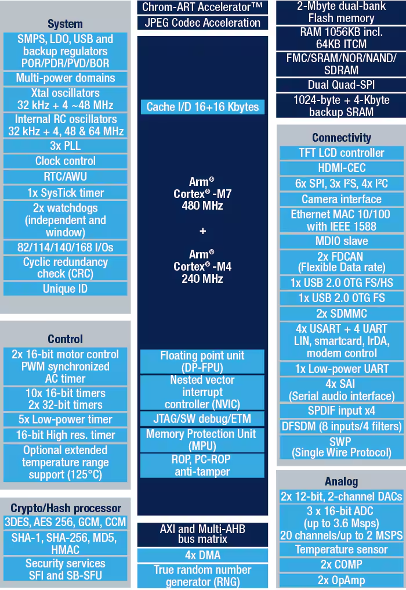
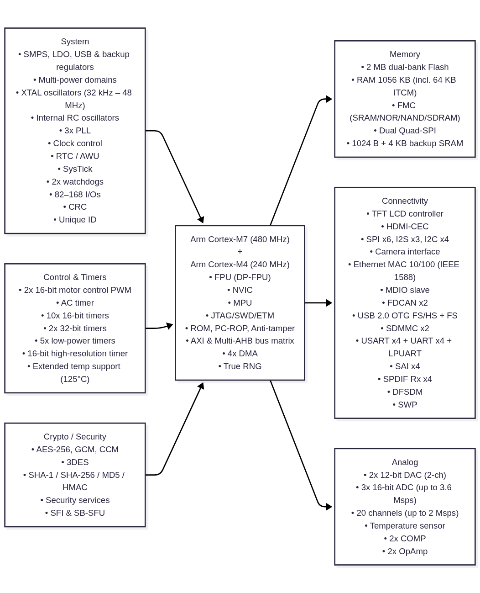
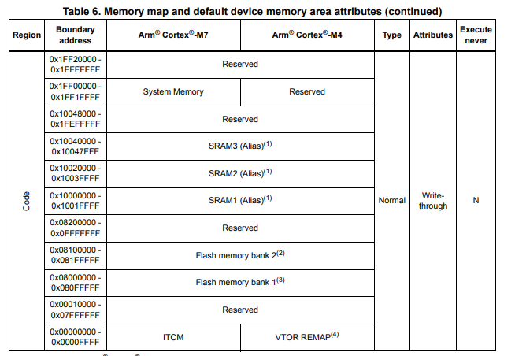
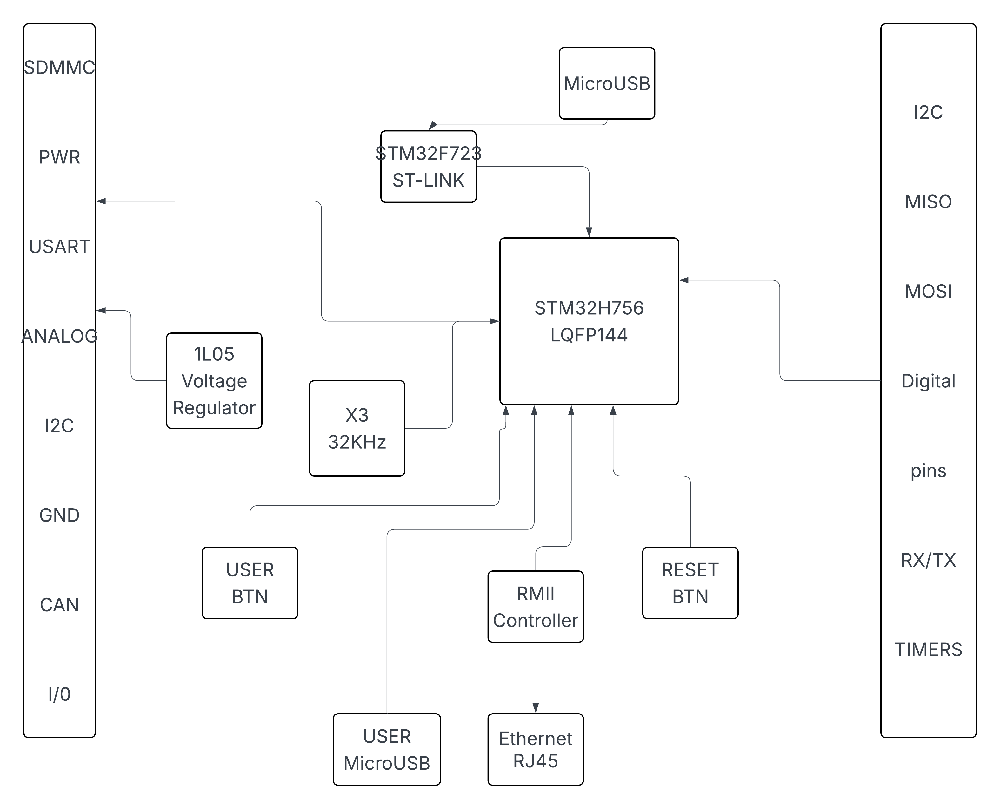

## STM32H755ZI
<!--  -->

- ARM architecture
- Dual core
    - M7 High performance core
    - M4 Optimized Low power core
- 3 Power domains
    - D1 - M7 core
    - D2 - M4 core
    - D3 - reset, clock control, power management, and GPIO

- 64bit AXI bus for D1
- 32bit AHB for D2 and D3

- SRAM
    - 864 KB of SRAM
    - 128 KB of TCM RAM
    - 64 KB of instruction TCM RAM
    - 4 KB of Backup SRAM
- 2 MB Flash. Divided into two independant banks
    - Flash Memory Bank 1
    - Flash Memory Bank 2
    

## Nucleo 144 H755ZI Outline


### D1 Subsystem
The D1 Subsystem contains all the high performance tasks.
- Tha Fat Boy M7 Cortex
- 480Mhz clocked!!!
- 64bit AXI Address bus
- 512 Kbyte AXI SRAM mapped at 0x2400 0000
- 2 x 1MB independant flash banks


### D2 Subsystem
Contains all the generic peripheral usage and optimization required tasks.
- Cortex M4
- 240Mhz
- AHB bus matrix, DMA,CAN,I2C and all


### D3 Subsystem
Used for system management. Lowwww power.


## Dual core operation
The M7 cores can work alone or work together.
They can do : 
- Data sharing
- Resource sharing
Inter Process Communication can be done by Semaphores and Interrupts.
 

### Dual core boot
At start, The processor to boot is selected by the BOOT Pin and the boot address can be definec by the option byte ```BOOT_ADDx```.
The defaults are:
- When Boot0=0:
    - 0x0800 0000 for CM7 
    - 0x0810 0000 for CM4 
- When Boot0=1:
    - Boot respectively from System memory or SRAM1


If the programmed boot memory address s invalied the defaults are:
- BCM7_ADD0: FLASH at 0x0800 0000
- BCM4_ADD0: FLASH at 0x0810 0000
- BCM7_ADD1: System Memory at 0x1FF0 0000
- BCM4_ADD1: SRAM1 at 0x1000 0000
### Dual core perks
- Each core works on it's own power domain.
- They can work individually.
- Any core can be booted or shutdown individually.
Using the option bits BCM7 and BCM4:

| BCM7 | BCM4 | Boot order |
|:--|:--|:--|
|0|0|Cortex®-M7 is booting and Cortex®-M4 clock is gated|
|0|1|Cortex®-M7 clock is gated and Cortex®-M4 is booting|
|1|0|Cortex®-M7 is booting and Cortex®-M4 clock is gated|
|1|1|Both Cortex®-M7 and Cortex®-M4 are booting|

- The first enabled CPU is the master
- The boot order when 


## RCC_GCR Global control register for boot 


