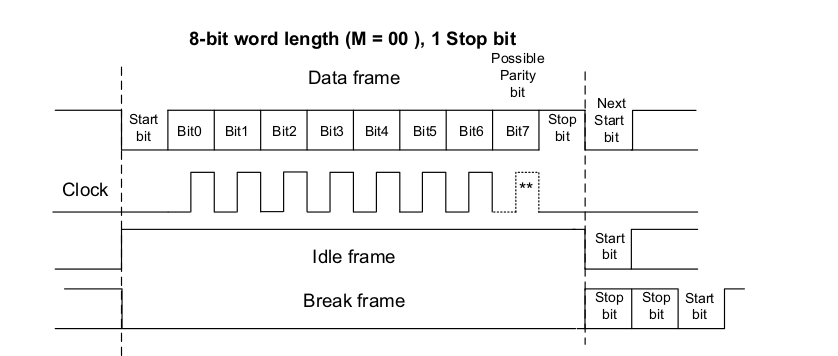
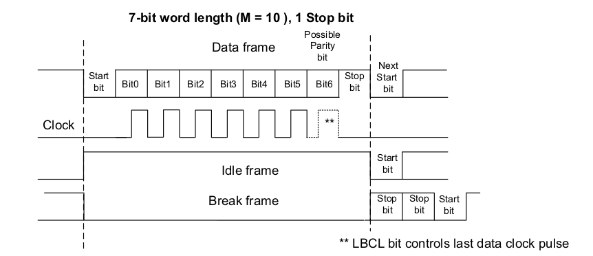

## UART/USART
Both are serial data communication. 
- UART works asynchrnously. It defines a baud rate at the start by both sides and transmit in that baud rate. This is less complex but more prone to error. 
- USART uses a clock line also for more reliable and synchronous data transfer. More lines,More complex

## USART in STM32H755ZI


- The COM controller holds the registers for USART/UART configuration.
- ```USART_BRR``` baud rate register stores the baud rate and pass it to the baud rate genrator.
- This is used by both shift registers of RX and TX. Both uses a queue (FIFO) structure for recieving and transmitting.
- We can read Data from ```USART_RDR``` register and write data to ```USART_TDR``` regiter. This will be moved to the queues.
- USART will use Direct Memory access for faster operation.
- When UART is in SPI mode, instead of baud rate generator, it will use the incoming clock for shift registers.
- ```USART_ISR``` holds the status of the uart_wkup and uart_it inturrupts.
- ```USART_CR1``` - Wordlength (M value in the figure)
- ```USART_CR2``` - Number of stop bits
- ```USART_CR3``` - DMA Enable




