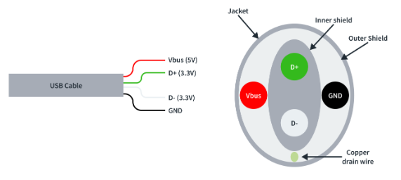
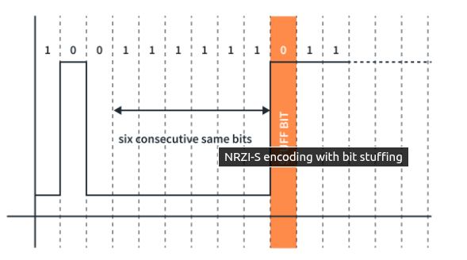
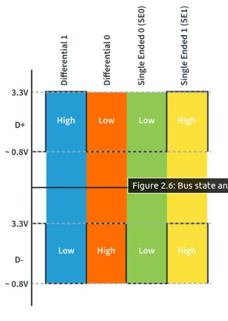
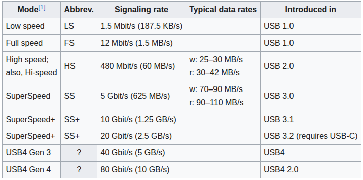
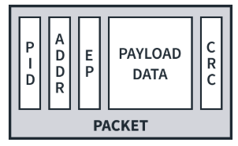

## Universal Serial Bus

- USB is a universal standard connectivity for data transfer as well as power.
- This is a serial synchronous communication protocol.
- In the case of USB 2.0 it uses a half duplex transmission using two data lines (Data- and Data+) for noise immune transfer.

## How usb works
- It is a master slave system.
- But unlike I2C or SPI, It won't allow more than one masters.
- Once a Host started the communication, It is the master.
- There is a chipset called **Host Controller** in the host which is responsible for the new connections and management.
- USBs can be connected to a single HOST using hubs. The starting point of this connection is called the root hub.
- The host allows up to 127 connections, which is limited by the 7-bit address supported by the USB protocol.

## NRZI encoding
- USB uses Non-Return-To-Zero encoding scheme.
- In this a **Change in signal** is cared as 0 and **Non-Changing Signal** as 1.

- Instead of representing the bit by a voltage level, a transition in signal is used.  

### Bit stuffing
- Simple. Stuff the opposite polarity signal after six bits.
- when a looong sequence of one or zero comes, there is a possiblity of unsync. So the opposite polarity of bit is stuffed after six bit.

## Data Transmission
- USB uses differential pair cables.
D+ and D-.
- Since USB have a data transfer of Mbyte scale, It can also cause Mhz scale radio signal interferance.
- Since D+ is the complement of D- these fields will cancel out and it will drastically reduce interferance.
- Also we are considering the difference between D+ and D-. If there is noise, it will be in both D+ and D-. taking difference, No problem!!.

|D+|D-|Value|
|:--|:--|:--|
| low | high | 0 |
| high | low | 1 |
| low | low| Single Ended Zero|
| high| high | Single Ended One|

### Speeds
- When D- is pulled high, USB operates in low-speed
- When D+ is pulled high, USB operates in full-speed

## The Dataframe
- **USB Endpoints**: This is a uniquely addressable area in the device which the USB host can access.
- They are unidirectional. Uses CRC (Cyclic Redundancy Check).
- USB works via polling. The host can poll the device for data.
#### Control Endpoints
- These are the essential endpoint for all devices. The 10% of the total transmission will be them. 20% for highspeed.
#### Inturrupt endpoints
- Nothing to do with inturrupts. It doesn’t truly support an interrupt mechanism rather it ensures that the host will use a polling rate i.e. the host checks for the data at a predictable interval.
#### Bulk Endpoints 
- These types of endpoints are used in devices where a large amount of data is transferred.

#### Isochronous Endpoints
- They are used to ensure the correctness of data. It won't inturrput the trasaction but it will help to flag wrong packets in streaming. Important for HID devices. 

### Packet/Frames
- Packets start with the SOF (Start of Frame) but.
- A single packet can have multiple transactions.
- Each can be a: 
    - Token Packet
    - Data Packet
    - Handshake Packet
    - Special Packet

Each packet can contain:
    - Packet ID
        - Type of packet
        - 4 Bits
    - Device Address
        - Target device
        - 7 Bits
        - Optional
    - Endpoint Address
        - Which endpoint
        - 4 Bits
    - CRC bits
        - 5/16 Bits
        - for CRC checking
    
