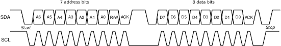
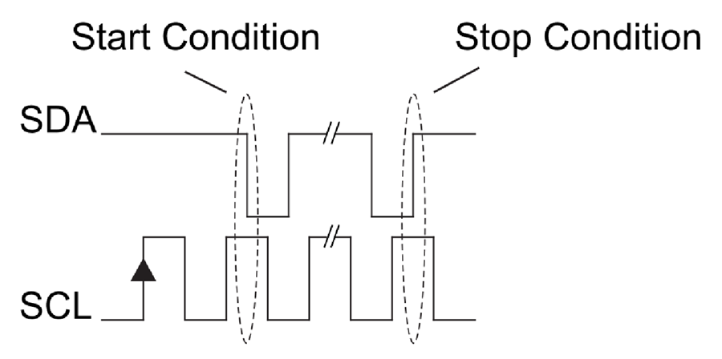
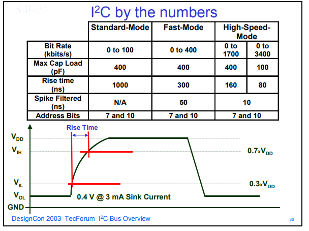
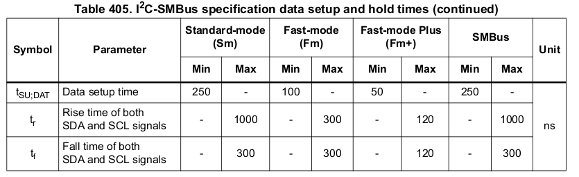
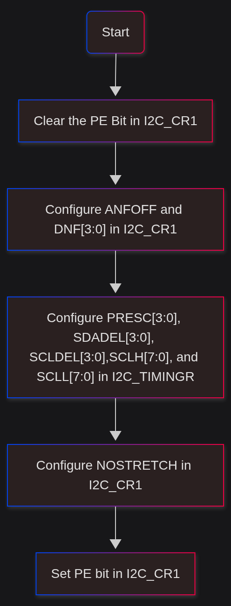
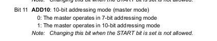

# I2C Bus
[manual](AN10216.pdf)
- Only two pins are required
- Each device have a unique address
- Multimaster and Collision detection
- 50ms Filtering
```lua

SCL --- 
SDA ---

```

| Start Bit (1) | Address (7bit) | W/R (1bit) | Data | Ack | 
|:--|:--|--|:--|:--|


## Procedure

- Wait untill the bus is free (SDA and SDL are both high)
- The Master then Generate the clock, and before the clock go low, the SDA should be lowered.
- This convention should be followed. The transition of SDA is only allowed when the clock is low.
- The data is read when the clock is changed from low to high

- Then the master will put the adress on the bus (7bit) + Read/write bit. By that time all the slaves should be listening.
- When a slave get its address, it says I'm here by lowering the SDA Line and the master will listen to that.
- After this successfull handshake, The master or slave will put data on the SDA and the other one will put ack bit while the sender listens.
- The Comms is stopped by pulling the SDA to high before clock is high


## Voltage Thresholds
- All signals above 70% of Vdd is considered HIGH

- All signals below 30% of Vdd is considered LOW

## Rise time and fall time limitations


# I2C in STM32H755ZI

- Multimaster Capablity
- Modes:
    - Standard mode (Sm) - 100KHz
    - Fast mode (Fm) - 400KHz
    - Fast mode plus (Fm+) - 1MHz
- SMBus and PMBus compatible.
- 7bit and 10bit addressing modes.
- 1 Byte buffer with DMA


- STM32h755ZI have 4 I2C buses
    - I2C 1
    - I2C 2
    - I2C 3
    - I2C 4


- I2C can act in 4 modes in this MC:
    - Slave Transmitter
    - Slave Reciever
    - Master Transmitter
    - Master Reciever
- By default it acts as slave. When the START condition is generated it switches to master and switch back to slave when STOP condition occures. This allows the multimaster operation.
- I2C can be enabled by setting the PE bit in the ```I2C_CR1``` register





- The slave addresses can be configured via I2C_OAR1 and I2C_OAR2 registers. It will only work if any one of it is configured.




