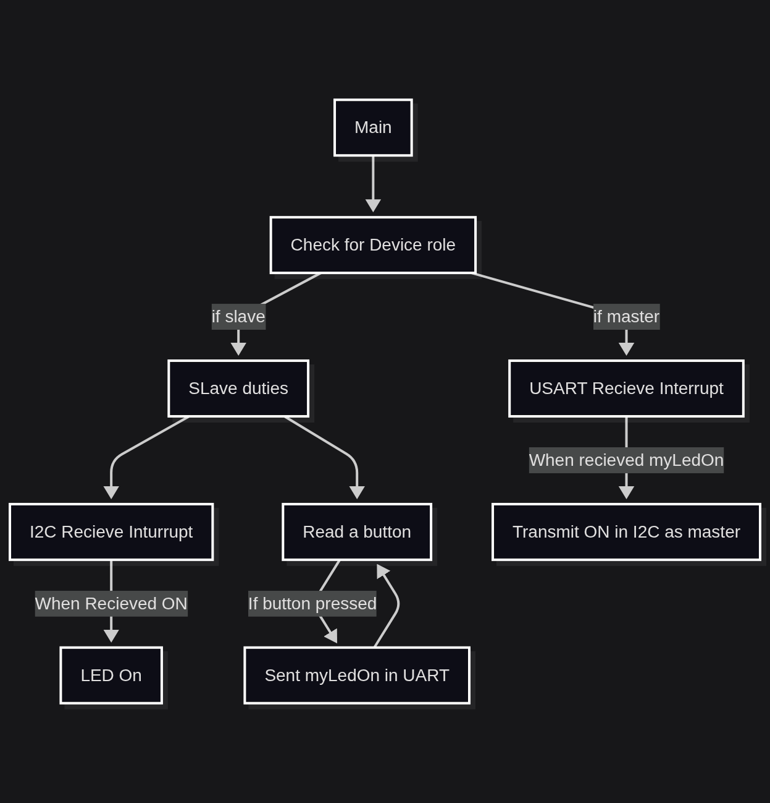

# I2C Project Documentation

**Target:** STM32H755ZI (NUCLEO)
**Peripherals:** UART5, I2C2, BSP Button, BSP LEDs
**Roles:**

* `0` → SLAVE
* `1` → MASTER

---
## Flowchart

## System Overview

This firmware implements a **role-based communication system**:

### SLAVE behavior

* Uses **USER button**
* When button is pressed:

  * Sends `"myLedOn"` over **UART5**
* Acts as **I2C slave**
* Receives `ON (0x01)` over I2C
* Toggles **GREEN LED**

### MASTER behavior

* Does **not** use button
* Receives `"myLedOn"` via **UART interrupt**
* When received:

  * Sends `ON (0x01)` over **I2C as master**

---

## 🧠 Role Selection Logic

At startup:

* If **USER button is pressed**, device becomes **MASTER**
* Otherwise, it becomes **SLAVE**

```c
if (BSP_PB_GetState(BUTTON_USER) == GPIO_PIN_SET)
{
  role = 1;
}
```

---

## Roles

| Component  | Used For                       |
| ---------- | ------------------------------ |
| BSP Button | Role selection + Slave trigger |
| UART5      | Slave → Master command         |
| I2C2       | Master → Slave LED command     |
| Interrupts | UART RX, I2C RX                |
| BSP LEDs   | Visual feedback                |

---

## Interrupt Flow

### UART RX Interrupt (MASTER)

* Waits for `"myLedOn"`
* Triggers I2C transmission

### I2C RX Interrupt (SLAVE)

* Waits for `0x01`
* Toggles LED

---

## Notes

* UART and I2C reception are **armed once at startup**
* Reception is **re-armed inside callbacks**
* BSP abstracts GPIO and LED handling

---
## Code Explanation
Used Variables:
```c
uint8_t role = 0; // 0 --> SLAVE , 1 --> MASTER

uint8_t uartTxData[] = "myLedOn";
uint8_t i2cTxData = 0x01; // ON command

uint8_t uartRxBuffer[8];
uint8_t i2cRxData;

I2C_HandleTypeDef hi2c2;
UART_HandleTypeDef huart5;
```

In the main function:
```c
int main(){
  ...

  if (BSP_PB_GetState(BUTTON_USER) == GPIO_PIN_SET)
      {
        role = 1;
      }
  HAL_Delay(200);
}
```
This is for selection of the role. And according to the roles:
```c
if (role == 1)
  {
    // MASTER
    HAL_UART_Receive_IT(&huart5, uartRxBuffer, sizeof(uartRxBuffer)); // Enables UART inturrupt
  }else{
    //SLAVE
    HAL_I2C_Slave_Receive_IT(&hi2c2, &i2cRxData, 1);
    // Enables I2C inturrupt
  }
```
In the application loop:
```c
uint8_t uartTxData[] = "myLedOn";
uint8_t i2cTxData = 0x01; // ON command

  while (1)
  {
    if (role == 1)
    {
      // ========= MASTER =========
      // No polling here
      // Everything handled by UART interrupt
    }
    else
    {
      // ========= SLAVE =========

      if (BSP_PB_GetState(BUTTON_USER) == GPIO_PIN_SET)
      {
        uint8_t uartTxData[] = "myLedOn";

        HAL_UART_Transmit(&huart5,
                          uartTxData,
                          sizeof(uartTxData) - 1,
                          100);
        // -1 because we want to avoid sending the termination charecter.
        HAL_Delay(50); // debounce
      }
    }
  }
```
In the UART inturrupt for the master:
```c
void HAL_UART_RxCpltCallback(UART_HandleTypeDef *huart)
{
    if (role == 1) // Checks for master
    {
        if (strncmp((char *)uartRxBuffer, "myLedOn", 7) == 0)
        {
            // Master retransmits ON via I2C
            HAL_I2C_Master_Transmit_IT(&hi2c2,
                                       60 << 1, // Slave address set in MX
                                       &i2cTxData,
                                       1);
        }

        // Restart UART reception
        HAL_UART_Receive_IT(&huart5,
                            uartRxBuffer,
                            sizeof(uartRxBuffer));
    }
}
```
I2C inturrupt from the slave side:
```c
uint8_t i2cRxData; // Data buffer

void HAL_I2C_SlaveRxCpltCallback(I2C_HandleTypeDef *hi2c)
{
    
        if (i2cRxData == 0x01) // CHecks for command
        {
            BSP_LED_Toggle(LED_GREEN);
        }

        HAL_I2C_Slave_Receive_IT(&hi2c2, &i2cRxData, 1);
    
}
```
## Full source code:
[Source Code](main.c)