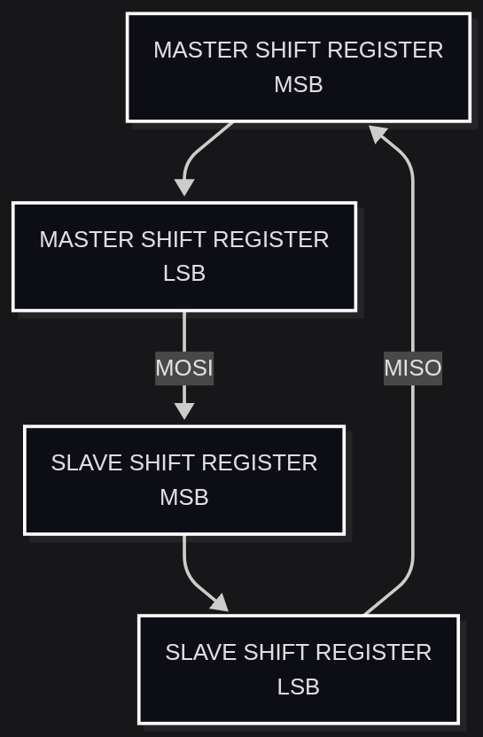
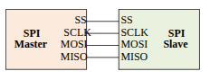
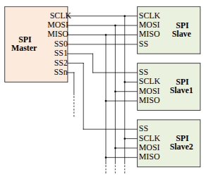
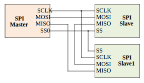
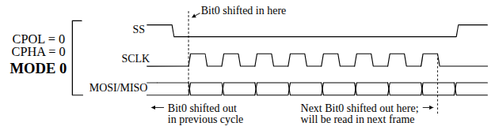
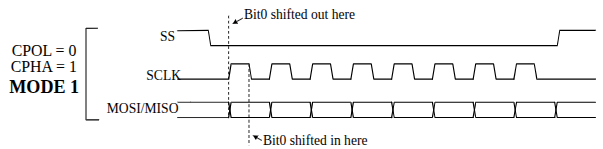
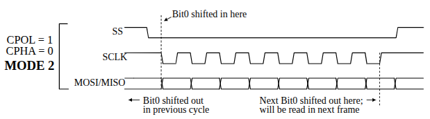
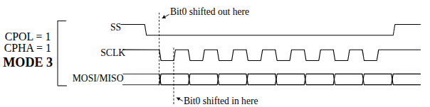

# Serial Peripheral Interface

- This is a synchronous serial communication system.
- Have 4 wires  
    ```
        MISO
        MOSI
        SS#
        SCLK
    ```
- Can be used in low to medium speed communication upto 5MBps.
- Simple,Inexpensive and suppoted by a large number of devices.
- can have **Single master** and **One or more slaves**.
## Operation
- Both of these contains a shift register.
- MISO and MOSI just make it a distributed shift regiester.


- These are **full duplex**
- Multiple slaves are selected using the Slave select (SS#) line.
- A single Slave select line can select 2 slaves.
- $n$ slave select lines can chose $2^n$ lines.

## Bus topologies
### Single master single slave

- The simple single master single slave operation. 
- Uses the shift registers as above.

### Multidrop configuration
- A single master is using multiple slaves by the $n$ number of selection lines either using a decoder ($2^n$ slaves) or without using a decoder ($n$ slaves.).


### Daisy Chain Configuration
- As the name suggests, connects the slaves in a chain.
- Since all of the devices are acting as a big shift register, it can transmit data to all slaves using a single shift register.
- All slaves have one common slave select signal.


## Data frame
SPI uses a simple data frame.
- The SS line will be high by default. 
- If a master want to communicate with a slave, master should pull down the SS of that particular slave.
- then there is no start or stop bits.
- The clocks have polarity (CPOL)
    - CPOL = 0,Clock idles at 0, first rising edge is asserted as leading edge.
    - CPOL = 1,Clock idles at 1, first falling edge is asserted as leading edge.

- Similiarly, the clock phase is also considered (CPHA).
    - if CPHA = 0, data is captured on the leading edge,
    - if CPHA = 1, data is captured on the edge after the leading edge. which is the falling edge for CPOL = 0.
- Based on these parameters the SPI have four modes.

-   |CPOL|CPHA|Mode| isShifting |
    |:--|:--|:--|:--|
    |0|0|Mode 0|Yes|
    |0|1|Mode 1|No|
    |1|0|Mode 2|Yes|
    |1|1|Mode 3|No|

### Mode 0
- Data is read in the leading edge cycle. that means, The data it reads is the data from the previous cycle.
- Similiarly the last bit is read in next frame. 


### Mode 1
- Here the clocks starts by rising edge and the data is read in the falling edge. by that time the data lines should be settled down.
- So we can read all the bits. No shifting needed.


### Mode 2
- Here the working is same as the Mode 0. The clock have the falling edge as leading according to the CPOL.
- The data is fetched on the falling edge. So the first data it is reading is the shifted bit from the previous frame.
- The last data bit of the frame is shifted to the next frame.


### Mode 3
- This is similiar to the Mode 1.
- Clock have a falling edge as leading edge. The data is read on the edge after the leading edge effectively the next rising edge.
- By this half-clock time the data will be setles. All the data bits can be fetched in the frame.
- No shifting.


## Advantages of SPI
- The clock is shared. No clock extraction needed.
- No address is needed. Simple transmission
- Any data size can be used. Data can be sequential any length.
- No arbitration
- Simple logic signals. any volage.

## Disadvantages
- Since this is p2p, more pins are requred for slave selecion.
- This does'nt have flow control,data ack or error checking. Master have no idea the data is correct.
- Only one master. The bus cannot be shared.

## SPI in STM32h755ZI
### Features
- Full-duplex synchronous transfers on three lines
- Half-duplex synchronous transfer on two lines (with bidirectional data line)
- From 4-bit up to 32-bit data size selection
- Multi master or multi slave mode capability
- Independent clock seperated from the APB.
- Hardware or software management of SS for both master and slave
- Programmable clock polarity and phase
- CRC error checking
-

Total 6 SPI Lines. <br> Configured in ```SPI_CFG2``` register.

/// Will continue...