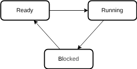

# FreeRTOS

## What is RTOS
- It's all about timing.
- Where time is life or time is money.
- multitask with precise scheduling.
- Ahh...It should have more controll over hardware if it realy want to do these.
### Types
- Hard RTOS
    - This os is guaranteed to complete a task on time. Not late. Not earll. Just in time.
- Soft RTOS
    - This have a relaxation time. This can multitask based on a priority based (Primittive) scheduling.
- Firm RTOS
    - Have a firm deadline. That means you are dead if you cross the line.

### Design
- Some RTOSs are designed to switch tasks only when a higher priority inturrupt come in.
- Some switches on regular clocks.

### Scheduling
A task have typically 3 states.

- More tasks are in ready or blocked because at a time one task can be ran by the CPU.
- The tasks which are ready is stored in a ready queue.
- If the ready queue is not lengthy, a non premptive time divided scheduling will do the trick.
- But if there is a large list we should look for the priority of the task
- If the ready queue is a doubly linked list, it would require traversing the list.

- When an inturupt strikes, It should be able to put the high priority task to CPU immediately. This time of response is called the flyback time. 
- In a well-designed RTOS, readying a new task will take 3 to 20 instructions per ready-queue entry, and restoration of the highest-priority ready task will take 5 to 30 instructions.

### Some Scheduling Algorithms
- **Cooperative scheduling**: No priority. the CPU switches its context between tasks on a cooperative manner. The task should be beware of this context switching
- **Premptive Scheduling** (Inturupting and resuming a task is managed by scheduler. task don't give a f):
    - **Round Robin Scheduling**: A time quant based priority scheduling.
    - **Rate Monotonic Scheduling**: //::TODO::
    - **Fixed priority preemptive scheduling.**
    - **Fixed-priority non-preemptive scheduling**
- **Earliest deadline first approach** : As the name suggests.
- **Stochastic digraphs with multi-threaded graph traversal** : wtf is that!!!

### Multiple process sharing same memory.
Sharing is caring. But it should done with respect. Multitasking systems uses different methods to efficiently sharing resources or owning resources temporarily.
- Mutexes
- Inturrupt masking
- Message passing

`In computer science, a semaphore is a variable or abstract data type used to control access to a common resource by multiple threads and avoid critical section problems in a concurrent system such as a multitasking operating system.`

### Mutexes
- Resources can be blocked using mutex by a task.
- While mutex is locked all the other tasks must wait before using that resource for the owner (the one who locked) to release it.
- There is a situation when a high priority task is waiting for a mutex to be unloacked by a low priority task. but the low priority task never get the CPU time to finish it.
- In such conditions, such high priority tasks have the property of mutex inheriting.
- This gets more complex when this is done in multiple levels.

### Deadlock
- Let's say Task T1 locks mutex M1, and it is waiting for mutex M2 to be unlocked. similiarly task T2 locks mutex M2, and it is waiting for M1 mutex to release.
- Both process will be waiting forever creating a **Cyclic Dependancy**
- This is deadlock.
- More than 2 tasks can also cause this.

## FreeRTOS

## Used Resources
[GeeksForGeeks](https://www.geeksforgeeks.org/operating-systems/real-time-operating-system-rtos/)