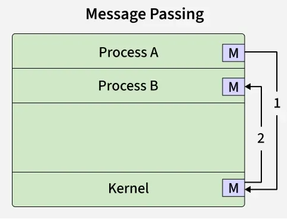

# FreeRTOS

## What is RTOS
- It's all about timing.
- Where time is life or time is money.
- multitask with precise scheduling.
- Ahh...It should have more controll over hardware if it realy want to do these.
### Types
- Hard RTOS
    - This os is guaranteed to complete a task on time. Not late. Not earll. Just in time.
- Soft RTOS
    - This have a relaxation time. This can multitask based on a priority based (Primittive) scheduling.
- Firm RTOS
    - Have a firm deadline. That means you are dead if you cross the line.

### Design
- Some RTOSs are designed to switch tasks only when a higher priority inturrupt come in.
- Some switches on regular clocks.

### Scheduling
A task have typically 3 states.

- More tasks are in ready or blocked because at a time one task can be ran by the CPU.
- The tasks which are ready is stored in a ready queue.
- If the ready queue is not lengthy, a non premptive time divided scheduling will do the trick.
- But if there is a large list we should look for the priority of the task
- If the ready queue is a doubly linked list, it would require traversing the list.

- When an inturupt strikes, It should be able to put the high priority task to CPU immediately. This time of response is called the flyback time. 
- In a well-designed RTOS, readying a new task will take 3 to 20 instructions per ready-queue entry, and restoration of the highest-priority ready task will take 5 to 30 instructions.

### Some Scheduling Algorithms
- **Cooperative scheduling**: No priority. the CPU switches its context between tasks on a cooperative manner. The task should be beware of this context switching
- **Premptive Scheduling** (Inturupting and resuming a task is managed by scheduler. task don't give a f):
    - **Round Robin Scheduling**: A time quant based priority scheduling.
    - **Rate Monotonic Scheduling**: //::TODO::
    - **Fixed priority preemptive scheduling.**
    - **Fixed-priority non-preemptive scheduling**
- **Earliest deadline first approach** : As the name suggests.
- **Stochastic digraphs with multi-threaded graph traversal** : wtf is that!!!

### Multiple process sharing same memory.
Sharing is caring. But it should done with respect. Multitasking systems uses different methods to efficiently sharing resources or owning resources temporarily.
- Mutexes
- Inturrupt masking
- Message passing

`In computer science, a semaphore is a variable or abstract data type used to control access to a common resource by multiple threads and avoid critical section problems in a concurrent system such as a multitasking operating system.`

### Mutexes
- Resources can be blocked using mutex by a task.
- While mutex is locked all the other tasks must wait before using that resource for the owner (the one who locked) to release it.
- There is a situation when a high priority task is waiting for a mutex to be unloacked by a low priority task. but the low priority task never get the CPU time to finish it.
- In such conditions, such high priority tasks have the property of mutex inheriting.
- This gets more complex when this is done in multiple levels.

### Deadlock
- Let's say Task T1 locks mutex M1, and it is waiting for mutex M2 to be unlocked. similiarly task T2 locks mutex M2, and it is waiting for M1 mutex to release.
- Both process will be waiting forever creating a **Cyclic Dependancy**
- This is deadlock.
- More than 2 tasks can also cause this.

## FreeRTOS
FreeRTOS is a free and opensource RTOS designed and ported for many devices. It is freely open to port to any device we want.

- This is essentially a wrapper on the HAL which contains built-in:
    - Task Scheuler
    - Memory manger

- It is available for building with various compilers and various target architectures.
- STM32 CubeMX Generates freertos based code by default.
- Even though it is designed for single core systems many manufactures like ESPRESSIF and STMicro ported it to work in multi core systems.
### FreeRTOS in STM32H7 Series
- ARM developed an API around the FreeRTOS called CMSIS (Cortex Microcontroller Software Interface Standard) which essentially contains all the functions for managing scheduling, IPC and memory management.
The list of functions attatched below.

[API Doc](https://arm-software.github.io/CMSIS_5/develop/RTOS2/html/index.html)

### CMSIS-RTOS C API v2 Function Reference

#### Kernel Information and Control
- `osKernelGetInfo` : Get RTOS Kernel Information.
- `osKernelGetState` : Get the current RTOS Kernel state.
- `osKernelGetSysTimerCount` : Get the RTOS kernel system timer count.
- `osKernelGetSysTimerFreq` : Get the RTOS kernel system timer frequency.
- `osKernelInitialize` : Initialize the RTOS Kernel.
- `osKernelLock` : Lock the RTOS Kernel scheduler.
- `osKernelUnlock` : Unlock the RTOS Kernel scheduler.
- `osKernelRestoreLock` : Restore the RTOS Kernel scheduler lock state.
- `osKernelResume` : Resume the RTOS Kernel scheduler.
- `osKernelStart` : Start the RTOS Kernel scheduler.
- `osKernelSuspend` : Suspend the RTOS Kernel scheduler.
- `osKernelGetTickCount` : Get the RTOS kernel tick count.
- `osKernelGetTickFreq` : Get the RTOS kernel tick frequency.
- `osKernelDestroyClass` : Destroy objects for specified safety classes.
- `osKernelProtect` : Protect the RTOS Kernel scheduler access.
- `osFaultResume` : Resume normal operation when exiting exception faults.

---

#### Thread Management
- `osThreadDetach` : Detach a thread (thread storage can be reclaimed when thread terminates).
- `osThreadEnumerate` : Enumerate active threads.
- `osThreadExit` : Terminate execution of current running thread.
- `osThreadGetCount` : Get number of active threads.
- `osThreadGetId` : Return the thread ID of the current running thread.
- `osThreadGetName` : Get name of a thread.
- `osThreadGetPriority` : Get current priority of a thread.
- `osThreadGetStackSize` : Get stack size of a thread.
- `osThreadGetStackSpace` : Get available stack space of a thread based on stack watermark recording during execution.
- `osThreadGetState` : Get current thread state of a thread.
- `osThreadJoin` : Wait for specified thread to terminate.
- `osThreadNew` : Create a thread and add it to Active Threads.
- `osThreadResume` : Resume execution of a thread.
- `osThreadSetPriority` : Change priority of a thread.
- `osThreadSuspend` : Suspend execution of a thread.
- `osThreadTerminate` : Terminate execution of a thread.
- `osThreadYield` : Pass control to next thread that is in state READY.
- `osThreadGetClass` : Get safety class of a thread.
- `osThreadGetZone` : Get MPU protected zone of a thread.
- `osThreadFeedWatchdog` : Feed watchdog of the current running thread.
- `osThreadProtectPrivileged` : Protect creation of privileged threads.
- `osThreadResumeClass` : Resume execution of threads for specified safety classes.
- `osThreadSuspendClass` : Suspend execution of threads for specified safety classes.
- `osThreadTerminateZone` : Terminate execution of threads assigned to a specified MPU protected zone.
- `osWatchdogAlarm_Handler` : Handler for expired thread watchdogs.
- `osZoneSetup_Callback` : Setup MPU protected zone (called when zone changes).

---

#### Thread Flags
- `osThreadFlagsSet` : Set the specified Thread Flags of a thread.
- `osThreadFlagsClear` : Clear the specified Thread Flags of current running thread.
- `osThreadFlagsGet` : Get the current Thread Flags of current running thread.
- `osThreadFlagsWait` : Wait for one or more Thread Flags of the current running thread to become signaled.

---

#### Event Flags
- `osEventFlagsGetName` : Get name of an Event Flags object.
- `osEventFlagsNew` : Create and Initialize an Event Flags object.
- `osEventFlagsDelete` : Delete an Event Flags object.
- `osEventFlagsSet` : Set the specified Event Flags.
- `osEventFlagsClear` : Clear the specified Event Flags.
- `osEventFlagsGet` : Get the current Event Flags.
- `osEventFlagsWait` : Wait for one or more Event Flags to become signaled.

---

#### Generic Wait Functions
- `osDelay` : Wait for Timeout (Time Delay).
- `osDelayUntil` : Wait until specified time.

---

#### Timer Management
- `osTimerDelete` : Delete a timer.
- `osTimerGetName` : Get name of a timer.
- `osTimerIsRunning` : Check if a timer is running.
- `osTimerNew` : Create and Initialize a timer.
- `osTimerStart` : Start or restart a timer.
- `osTimerStop` : Stop a timer.

---

#### Mutex Management
- `osMutexAcquire` : Acquire a Mutex or timeout if it is locked.
- `osMutexDelete` : Delete a Mutex object.
- `osMutexGetName` : Get name of a Mutex object.
- `osMutexGetOwner` : Get Thread which owns a Mutex object.
- `osMutexNew` : Create and Initialize a Mutex object.
- `osMutexRelease` : Release a Mutex that was acquired by `osMutexAcquire`.

---

#### Semaphores
- `osSemaphoreAcquire` : Acquire a Semaphore token or timeout if no tokens are available.
- `osSemaphoreDelete` : Delete a Semaphore object.
- `osSemaphoreGetCount` : Get current Semaphore token count.
- `osSemaphoreGetName` : Get name of a Semaphore object.
- `osSemaphoreNew` : Create and Initialize a Semaphore object.
- `osSemaphoreRelease` : Release a Semaphore token up to the initial maximum count.

---

#### Memory Pool
- `osMemoryPoolAlloc` : Allocate a memory block from a Memory Pool.
- `osMemoryPoolDelete` : Delete a Memory Pool object.
- `osMemoryPoolFree` : Return an allocated memory block back to a Memory Pool.
- `osMemoryPoolGetBlockSize` : Get memory block size in a Memory Pool.
- `osMemoryPoolGetCapacity` : Get maximum number of memory blocks in a Memory Pool.
- `osMemoryPoolGetCount` : Get number of memory blocks used in a Memory Pool.
- `osMemoryPoolGetName` : Get name of a Memory Pool object.
- `osMemoryPoolGetSpace` : Get number of memory blocks available in a Memory Pool.
- `osMemoryPoolNew` : Create and Initialize a Memory Pool object.

---

#### Message Queue
- `osMessageQueueDelete` : Delete a Message Queue object.
- `osMessageQueueGet` : Get a Message from a Queue or timeout if Queue is empty.
- `osMessageQueueGetCapacity` : Get maximum number of messages in a Message Queue.
- `osMessageQueueGetCount` : Get number of queued messages in a Message Queue.
- `osMessageQueueGetMsgSize` : Get maximum message size in a Message Queue.
- `osMessageQueueGetName` : Get name of a Message Queue object.
- `osMessageQueueGetSpace` : Get number of available slots for messages in a Message Queue.
- `osMessageQueueNew` : Create and Initialize a Message Queue object.
- `osMessageQueuePut` : Put a Message into a Queue or timeout if Queue is full.
- `osMessageQueueReset` : Reset a Message Queue to initial empty state.

---

#### Functions Callable from Threads and Interrupt Service Routines (ISR)

- `osKernelGetInfo`
- `osKernelGetState`
- `osKernelGetTickCount`
- `osKernelGetTickFreq`
- `osKernelGetSysTimerCount`
- `osKernelGetSysTimerFreq`

- `osThreadGetName`
- `osThreadGetId`
- `osThreadFlagsSet`

- `osTimerGetName`

- `osEventFlagsGetName`
- `osEventFlagsSet`
- `osEventFlagsClear`
- `osEventFlagsGet`
- `osEventFlagsWait`

- `osMutexGetName`

- `osSemaphoreGetName`
- `osSemaphoreAcquire`
- `osSemaphoreRelease`
- `osSemaphoreGetCount`

- `osMemoryPoolGetName`
- `osMemoryPoolAlloc`
- `osMemoryPoolFree`
- `osMemoryPoolGetCapacity`
- `osMemoryPoolGetBlockSize`
- `osMemoryPoolGetCount`
- `osMemoryPoolGetSpace`

- `osMessageQueueGetName`
- `osMessageQueuePut`
- `osMessageQueueGet`
- `osMessageQueueGetCapacity`
- `osMessageQueueGetMsgSize`
- `osMessageQueueGetCount`
- `osMessageQueueGetSpace`

## IPC (Inter-Process Communiation)
It is a mechanism used to share and sync common resources between two processes while avoiding conflicts.

### Message Passing

## Used Resources
[GeeksForGeeks RTOS](https://www.geeksforgeeks.org/operating-systems/real-time-operating-system-rtos/)
[GeeksForGeeks IPC](https://www.geeksforgeeks.org/operating-systems/inter-process-communication-ipc/)